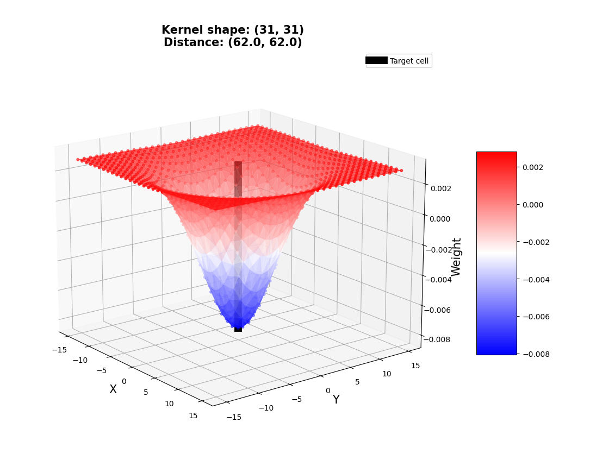
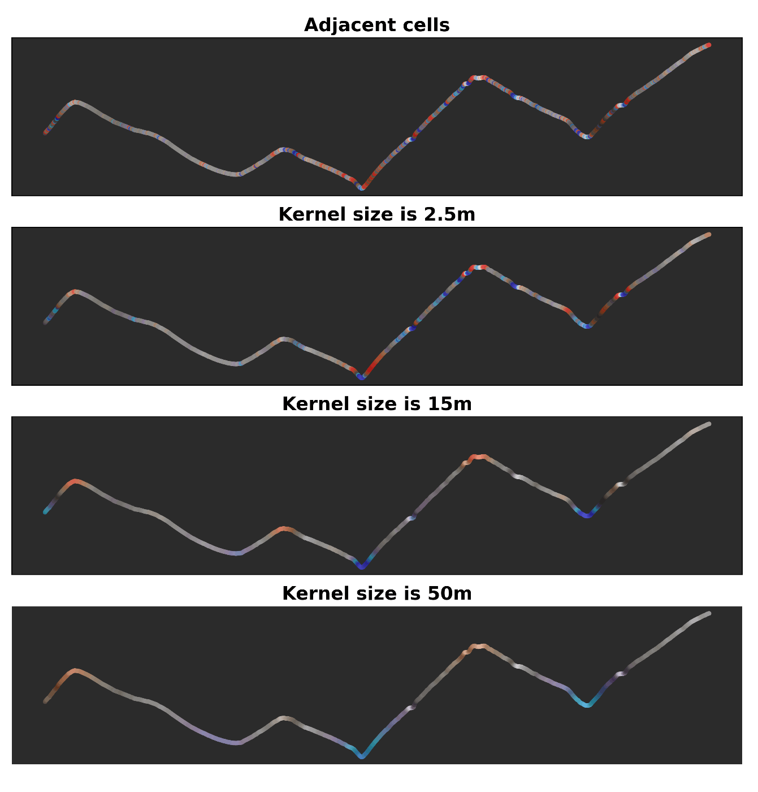

# **Overview**
この QGIS プラグインは DTM（DEM）から微地形図の RGB 画像を作成する為のプラグインです。

# **Install**
QGISのプラグインとして公開しているので、プラグイン管理画面で 「Topo Maps」 と検索すれば表示されます。

# **Layers**
以下の順番で上から重ねたものを使用しています。

<ul>
    <li>傾斜図（Slope）</li>
    <li>地形位置指数（TPI: Topographic Position Index）</li>
    <li>地形凹凸指数（TRI: Terrain Ruggedness Index）</li>
    <li>陰影起伏図（Hillshade）</li>
</ul>

# **Styles**

# **Warning**
投影座標系のDTMを使用する事を前提としています。地理座標系のデータでも動作しますが、綺麗に作成されない場合があります。このプラグインでは地理座標系のデータを渡すと、UTMの投影法を推定し、投影変換を行ってから微地形図を作成するので、各パラメーターはメートル単位で指定する事が出来ます。

# **Resampling**
このプラグインでは微地形図を計算する前に、DTMのリサンプリングを行う事ができます。1m 程度の分解能の DTM であれば綺麗な微地形図が作成できますが、5m や 10m の DTM を使用するとあまり綺麗な微地形図が作成できません。その為、分解能が低い DTM の場合は最初に分解能を 1m 程度にリサンプリングするのがおススメです。

# **Options**
基本的には初期設定のまま使用できますが、分解能に合わせて各計算の詳細を変更する事ができます。

## Slope Options
傾斜は `gdal.DEMProcessing` で計算しています。
<dl>
    <dt>傾斜計算の距離（距離を指定）</dt>
        <dd>メートル単位で指定した距離離れた場所との傾斜を計算します。</dd>
    <dt>傾斜計算の距離（セル数で指定）</dt>
        <dd>セル単位で指定した距離離れた場所との傾斜を計算します。隣接セルとの傾斜を計算する場合はこちらを使用して下さい。</dd>
    <dt>ガウシアンフィルター</dt>
        <dd>傾斜計算した後にガウシアンフィルターを使用してぼかしを入れる事が出来ます。</dd>
    <dt>相対的な透過率の変更</dt>
        <dd>データによっては色が必要以上に濃く出てしまうので、このスライダーで相対的な透過率を調整して下さい。</dd>
</dl>

## TPI Options
TPI ではオリジナルの DTM と畳み込み後の DTM の差分を計算します。正の値を取る場合は該当セルが付近より高い位置にある事を示し、負の値を取る場合は付近よりも低い位置にある事を示します。
<dl>
    <dt>カーネルサイズ</dt>
        <dd>カーネルサイズは「距離」と「セル数」で指定できます。カーネルサイズを小さくすれば、より詳細な特徴（例えば小さな凹凸）が表現されますが、大きな特徴（例えば尾根や沢）が分かりづらくなります。微地形図は森林を対象とする事が多いと思われますので、大体 10～20m 程度で設定するのがおススメです。</dd>
    <dt>カーネルタイプ</dt>
        <dd>TPI を計算する場合は隣接セルを使用するよりも、ある程度離れた場所との比較を行う方が、変化が分かりやすいです。デフォルトで設定されている「ドーナツ」か「逆ガウシアン」がおススメです。</dd>
    <dt>外れ値処理</dt>
        <dd>TPIの計算では、一部に極端な値が現れる場合があります。そのまま描画してしまうと、その外れ値に引っ張られて綺麗に可視化されません。外れ値を丸めてから描画した方が良いでしょう。</dd>
    <dt>相対的な透過率の変更</dt>
        <dd>データによっては色が必要以上に濃く出てしまうので、このスライダーで相対的な透過率を調整して下さい。</dd>
    <dt>Multiple TPI</dt>
        <dd>TPIの画像を2枚重ねる事が出来ます。これは1枚目のTPIで設定した距離の乗数を設定し、1枚目を10m、2枚目は50mなどに設定する事で小さい地形の変化と大きな地形の変化を同じ微地形図で表現する為に追加します。</dd>
</dl>

## TRI Options
TRIは`gdal.DEMProcessing`を使用して計算されます。デフォルトでは重ねていません。

### 参考
- [gdal.DEMProcessing](https://gdal.org/en/latest/programs/gdaldem.html)

## Hillshade Options
Hillshadeは`gdal.DEMProcessing`を使用して計算されます。このプラグインで作成される微地形図のベースには陰影起伏図を使用しています。
<dl>
    <dt>光源タイプ</dt>
        <dd>「Single」は一方向から光を当てた陰影起伏図を作成し、「Multiple」は 225°, 270°, 315°, 360°の方向から光を当てた陰影起伏図を作成します。</dd>
    <dt>方位</dt>
        <dd>光源タイプで "Single" を選択した場合はこの方向から光を当てます。</dd>
    <dt>高度</dt>
        <dd>高度は光源の傾斜角です。0°が水平を表し、90°は真上を表します。90°以外を選択すると、影のある斜面とない斜面が表現されてしまうので、90°で設定するのがおススメです。</dd>
    <dt>強調係数</dt>
        <dd>標高を事前に乗算するために使用される係数。</dd>
    <dt>ガウシアンフィルターを適用する</dt>
        <dd>高分解能の DTM を使用する場合はフィルターを通して少し変化を抑えた方が見やすい場合があります。必要に応じて使用して下さい。</dd>
    <dt>外れ値処理</dt>
        <dd>陰影起伏図を作成後に外れ値を処理する事で、輪郭がハッキリした陰影起伏図を作成する事が出来ます。</dd>
</dl>

### 参考

- [gdal.DEMProcessing](https://gdal.org/en/latest/programs/gdaldem.html)

## Others Options
<dl>
    <dt>画像をシャープにする</dt>
        <dd>UnsharpMaskで画像をシャープにします。詳しくは gdal.DEMProcessing のドキュメントを参照してください</dd>
    <dt>コントラスト調整</dt>
        <dd>コントラストを調整します。</dd>
</dl>

### 参考

- [Pillow](https://pillow.readthedocs.io/en/stable/reference/ImageFilter.html)

- [Wikipedia: UnsharpMask](https://en.wikipedia.org/wiki/Unsharp_masking#Digital_unsharp_masking)

# **Preview composited image**
このプラグインで高分解能の DTM から微地形図を作成する場合は時間が掛かります。サイズが大きな DTM の場合は`実行`ボタン左横の`サンプルの確認`にチェックを入れて実行する事で、全体ではなく一部の範囲で計算・確認を行う事ができます。

## **Styled images by resolution**

### Resolution = 0.5m

### Resolution = 5.0m (resampled = 1.0m)

## **UI Image**
