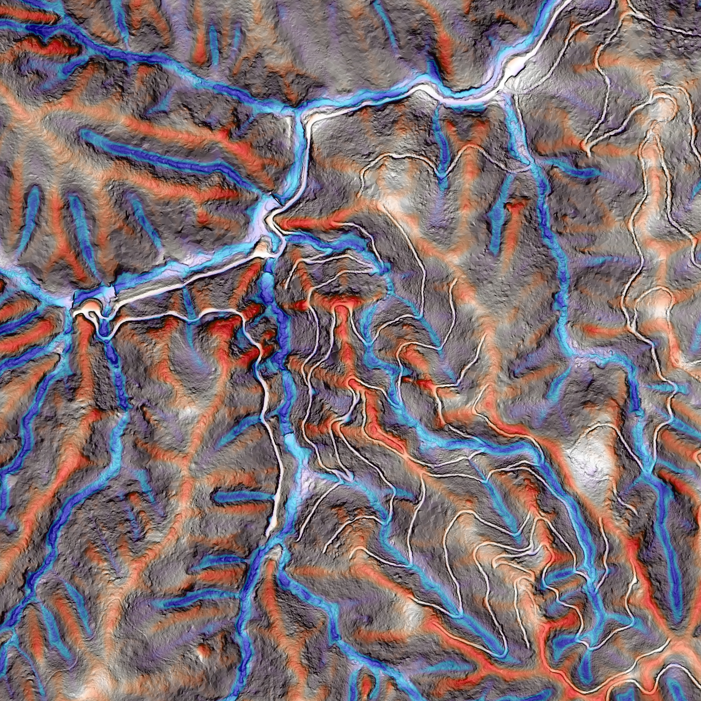
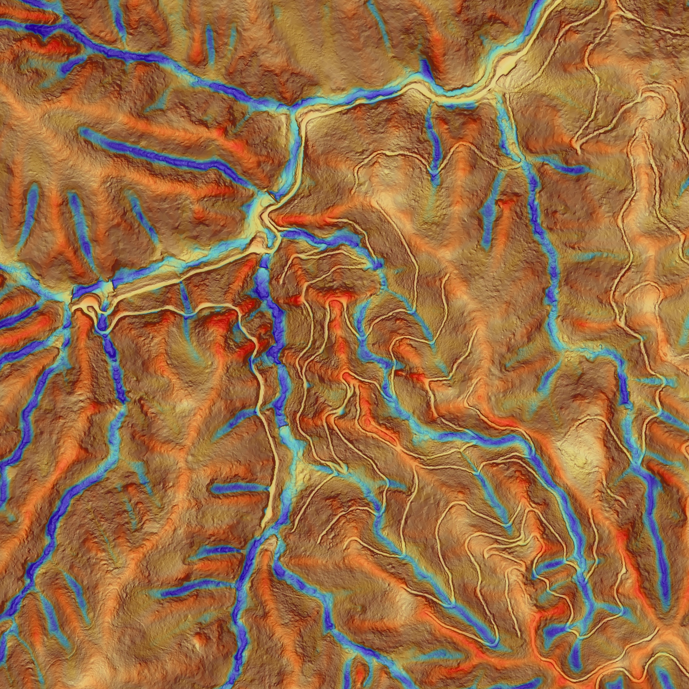
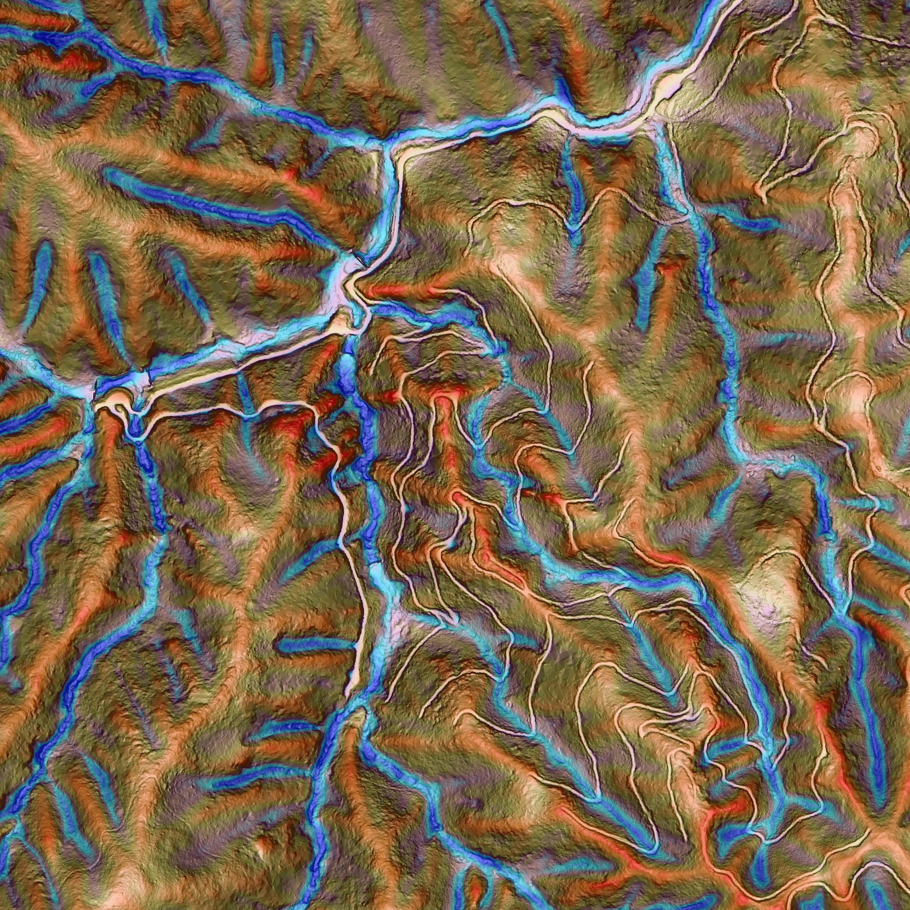
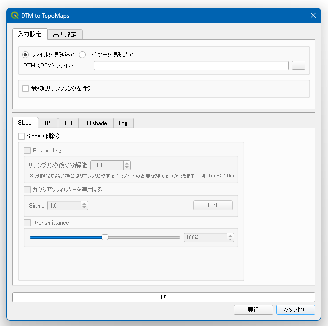

# Topo Maps

## Overview
この QGIS プラグインは DTM（DEM）から微地形図の RGB 画像を作成する為のプラグインです。

## Layers
以下の順番で上から重ねたものを使用しています。

<ul>
    <li>傾斜図（Slope）</li>
    <li>地形位置指数（TPI: Topographic Position Index）</li>
    <li>地形凹凸指数（TRI: Terrain Ruggedness Index）</li>
    <li>陰影起伏図（Hillshade）</li>
</ul>

## Styled
### CS-Map Styled
CS-立体図風の色を設定します。"風"と付けているのは、似た色見にしてはいますが、若干変えている部分がある為です。

### Vintage-Map Styled
茶色をベースに作成した Map です。

### RGB-Map Styled
尾根は赤、斜面を緑、谷部は青に設定した Map です。

## Options
基本的には初期設定のまま使用できますが、分解能に合わせて各計算の詳細を変更する事ができます。
### Slope Options
傾斜は "gdal.DEMProcessing" で計算しています。
<dl>
    <dt>リサンプリング</dt>
    <dd>傾斜を計算する前に DTM のリサンプリングを行います。このオプションは分解能が低い場合は有効な処理です（10m未満の場合は10mにリサンプリングする等）。</dd>
    <dt>相対的な透過率の変更</dt>
    <dd>データによっては色が必要以上に濃く出てしまうので、このスライダーで相対的な透過率を調整して下さい。</dd>
</dl>

### TPI Options
TPI ではオリジナルの DTM と畳み込み後の DTM の差分を計算します。正の値を取る場合は該当セルが付近より高い位置にある事を示し、負の値を取る場合は付近よりも低い位置にある事を示します。
<dl>
    <dt>カーネルサイズ</dt>
    <dd>カーネルサイズは「距離」と「セル数」で指定できますが、地理座標系のデータを使用する場合は「セル数」で設定してください。カーネルサイズを小さくすれば、より詳細な特徴（例えば小さな凹凸）が表現されますが、大きな特徴（例えば尾根や沢）が分かりづらくなります。微地形図は森林を対象とする事が多いと思われますので、大体 10～20m 程度で設定するのがおススメです。</dd>
    <dt>カーネルタイプ</dt>
    <dd>TPI を計算する場合は隣接セルを使用するよりも、ある程度離れた場所との比較を行う方が、変化が分かりやすいです。デフォルトで設定されている「ドーナツ」がおススメです。</dd>
    <dt>外れ値処理</dt>
    <dd>TPIの計算では、一部に極端な値が現れる場合があります。そのまま描画してしまうと、その外れ値に引っ張られて綺麗に可視化されません。外れ値を丸めてから描画した方が良いでしょう。</dd>
    <dt>相対的な透過率の変更</dt>
    <dd>データによっては色が必要以上に濃く出てしまうので、このスライダーで相対的な透過率を調整して下さい。</dd>
</dl>

### Hillshade Options
このプラグインで作成される微地形図のベースには陰影起伏図を使用しています。陰影起伏図の作成には様々なパラメーターがありますが、基本的にはデフォルトのまま使用しても問題ありません。
<dl>
    <dt>光源タイプ</dt>
    <dd>「Single」は一方向から光を当てた陰影起伏図を作成し、「Multiple」は 225°, 270°, 315°, 360°の方向から光を当てた陰影起伏図を作成します。</dd>
    <dt>方位</dt>
    <dd>光源タイプで "Single" を選択した場合はこの方向から光を当てます。</dd>
    <dt>高度</dt>
    <dd>高度は光源の傾斜角です。0°が水平を表し、90°は真上を表します。90°以外を選択すると、影のある斜面とない斜面が表現されてしまうので、90°で設定するのがおススメです。</dd>
    <dt>強調係数</dt>
    <dd>標高を事前に乗算するために使用される係数。</dd>
    <dt>ガウシアンフィルターを適用する</dt>
    <dd>高分解能の DTM を使用する場合はフィルターを通して少し変化を抑えた方が見やすい場合があります。必要に応じて使用して下さい。</dd>
</dl>

## UI Image
