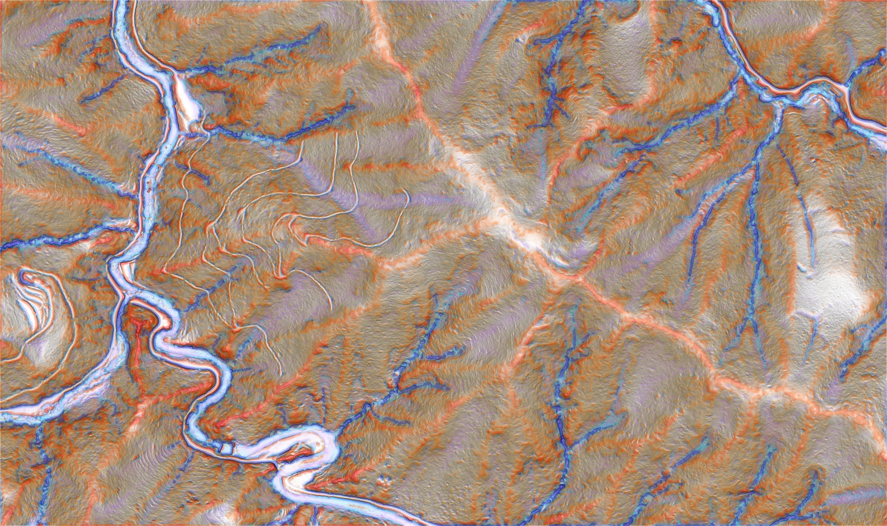
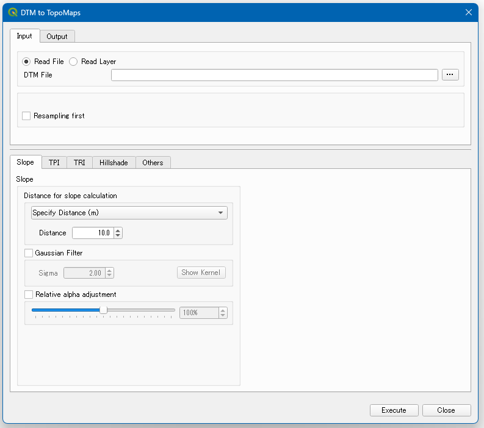

# **Overview**
This QGIS plugin is for creating RGB images of microtopographic maps from DTM (DEM).

 

# **Install**
Since it is published as a plugin for QGIS, it can be found by searching for “Topo Maps” in the plugin management screen.

 

# **Layers**
The following order is used, layered from the top.
 - Slope
 - TPI (Topographic Position Index)
 - TRI (Terrain Ruggedness Index)
 - Hillshade

 

# **Styles**

The plugin can generate microtopographic maps in a variety of colors, in three different styles, or the user can create his or her own style.

### Original-Map Style

### Vintage-Map Style

### RGB-Map Style

> 😁 **Note:** This microtopographic map was created using a DTM with a resolution of 50 cm.

 

# **Resampling**
This plug-in can resample DTMs before calculating microtopography. 1m resolution DTMs can produce beautiful microtopography, but 5m or 10m resolution DTMs will not produce very beautiful microtopography. Therefore, it is recommended to first resample to a resolution of about 1m for low-resolution DTMs.

>🧐 **Note:**
> This plug-in assumes the use of DTMs with projected coordinate systems. It also works with geographic coordinate system data, but it may not produce a clean microtopographic map. When using geographic coordinate system data, each parameter can be specified in meters.

 

# **Options**
Basically, the default settings can be used, but the details of each calculation can be changed to suit the resolution.

## **Slope Options**
The slope is calculated by `gdal.DEMProcessing`.

#### *Distance for slope calculation (Specify Distance(m))*
Calculates the slope to and from a location a specified distance away in meters.

#### *Distance for slope calculation (Specify Cells)*
Calculates the slope of a cell to a location a specified distance away. Use this to calculate slopes with adjacent cells.

#### *Gaussian Filter*
After calculating the tilt, a Gaussian filter can be used to add blur. The larger the `Sigma` parameter, the larger the kernel size and the stronger the blur.

#### *Relative alpha adjustment*
Some data may make colors appear darker than necessary, so use this slider to adjust the relative transparency.

## **TPI Options**
TPI calculates the difference between the original DTM and the convolved DTM. A positive value indicates that the cell is higher than the neighborhood, while a negative value indicates that the cell is lower than the neighborhood.
#### *Specify kernel size*
Kernel size can be specified by “distance” and “number of cells”.

#### *Kernel Types*
There are five kernel types: “Donut,” “Average,” “Use Adjacent Cells,” “Gaussian,” and “Inverse Gaussian,” so choose the kernel you prefer.

#### *Outlier Treatment*
In the TPI calculation, some extreme values may appear. If you draw them as they are, they will be pulled by the outliers and will not be visualized cleanly. It is better to outlier treatment before drawing.

#### *Relative alpha adjustment*
Some data may make colors appear darker than necessary, so use this slider to adjust the relative transparency.

#### *Multiple TPI*
Two TPI images can be stacked. This is done by setting the multiplier of the distance set in the first TPI image to 10 meters for the first image, 50 meters for the second image, and so on, so that small and large topographic changes can be represented on the same microtopographic map.

> 🧐 **Note:** The TPI is an index that calculates the position of the target compared to the surrounding height. Rather than choosing an `average` or `Gaussian`, a `doughnut` or `inverse Gaussian` kernel can be used to calculate the index by weighting the surrounding information.

> 🧐 **Note:** Smaller kernel sizes will show more detailed features (e.g., small bumps), but will make large features (e.g., ridges and streams) more difficult to recognize. Since most microtopographic maps are expected to cover forests, it is recommended to set the kernel size at approximately 10 to 20 meters.

 

## TRI Options
TRI is calculated using `gdal.DEMProcessing`. The default setting is not to use it, but you can overlay it on top of the shade undulation diagram by checking the checkbox.
 

## Hillshade Options
Hillshade is calculated using `gdal.DEMProcessing`. Shaded undulation maps are used as the base for the microtopographic maps produced by this plugin.

#### *Shading*
`Single` produces a shading undulation diagram illuminated from one direction, while `Multiple` produces a shading undulation diagram illuminated from 225°, 270°, 315°, and 360° directions.
#### *方位*
If “Single” is selected for the light source type, light is applied from this direction.

#### *Altitude*
The altitude is the slope angle of the light source; 0° represents horizontal and 90° represents directly above; selecting anything other than 90° will result in the representation of slopes with and without shadow, so it is recommended to set it at 90°.

#### *Z Factor*
Factor used to pre-multiply elevation.

#### *Gaussian Filter*
When using a high-resolution DTM, it may be easier to see a little less variation through the filter. Use as necessary.

#### *Outlier Treatment*
By processing outliers after creating a "Hillshade", it is possible to create a "Hillshade" with clear contours.

## Others Options
#### *Unsharp Mask*
Sharpen the image with UnsharpMask. See Wikipedia for more information.

[Wikipedia: UnsharpMask](https://en.wikipedia.org/wiki/Unsharp_masking#Digital_unsharp_masking)

#### *Contrast*
Adjust the contrast.

 

# **Preview composited image**
Creating microtopographic maps from high-resolution DTMs with this plugin can be time consuming. For large size DTMs, you can check the `Check sample' checkbox and run the plugin to calculate and check a portion of the area instead of the whole area.

## **Styled images by resolution**

> Resolution = 0.5m

> Resolution = 5.0m (resampled = 1.0m)

## **UI Image**
