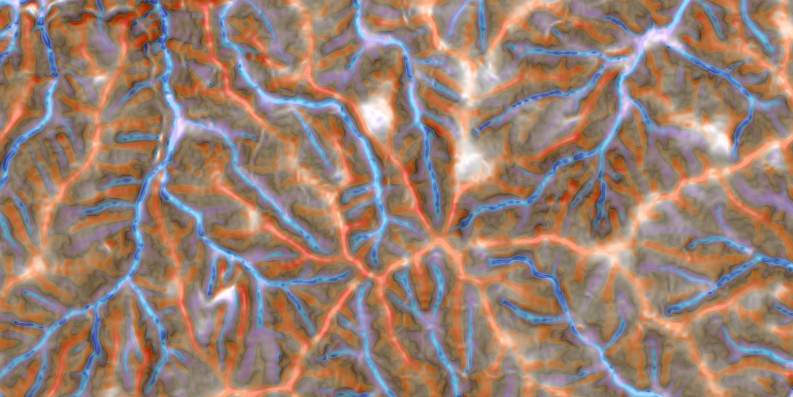

Here is the translation of the `README.md` file into English:

---

## **Overview**
This QGIS plugin is designed to create RGB images of micro-topographic maps from DTM (DEM).

## **Install**
Clone this repository into the Plugin directory. There is no need to install external packages. It works in the default QGIS environment.

## **Layers**
The following layers are used in the order from top to bottom:

<ul>
    <li>Slope</li>
    <li>Topographic Position Index (TPI)</li>
    <li>Terrain Ruggedness Index (TRI)</li>
    <li>Hillshade</li>
</ul>

## **Styles**

## **Resampling**
This plugin allows resampling of the DTM before calculating the micro-topographic map. A DTM with a resolution of about 1m can create a beautiful micro-topographic map, but using a 5m or 10m DTM will not produce a very clear map. Therefore, it is recommended to resample the DTM to about 1m if the resolution is low. However, for geographic coordinate systems, determine the resolution with relative numbers such as `1/2`.

## **Options**
The default settings can be used, but the details of each calculation can be changed according to the resolution.

### Slope Options
The slope is calculated using `gdal.DEMProcessing`.
<dl>
    <dt>Resampling</dt>
    <dd>Resample the DTM before calculating the slope. This option is effective if the resolution is low (e.g., resampling to 10m if it is less than 10m).</dd>
    <dt>Change relative transparency</dt>
    <dd>Depending on the data, the colors may appear too dark, so adjust the relative transparency with this slider.</dd>
</dl>

### TPI Options
TPI calculates the difference between the original DTM and the convolved DTM. Positive values indicate that the cell is higher than the surrounding area, while negative values indicate that it is lower.
<dl>
    <dt>Kernel size</dt>
    <dd>The kernel size can be specified by "distance" or "number of cells", but for geographic coordinate system data, set it by "number of cells". A smaller kernel size will represent more detailed features (e.g., small bumps), but larger features (e.g., ridges and valleys) will be less noticeable. Since micro-topographic maps are often targeted at forests, it is recommended to set it to about 10-20m.</dd>
    <dt>Kernel type</dt>
    <dd>When calculating TPI, it is easier to see changes by comparing with a somewhat distant location rather than using adjacent cells. The default "donut" is recommended.</dd>
    <dt>Outlier processing</dt>
    <dd>In TPI calculations, extreme values may appear in some areas. If drawn as is, it will not be visualized nicely due to these outliers. It is better to round off the outliers before drawing.</dd>
    <dt>Change relative transparency</dt>
    <dd>Depending on the data, the colors may appear too dark, so adjust the relative transparency with this slider.</dd>
</dl>

### Hillshade Options
The base of the micro-topographic map created by this plugin uses hillshade. There are various parameters for creating hillshade, but the default settings can be used without any problems.
<dl>
    <dt>Light source type</dt>
    <dd>"Single" creates a hillshade with light from one direction, and "Multiple" creates a hillshade with light from 225°, 270°, 315°, and 360° directions.</dd>
    <dt>Azimuth</dt>
    <dd>If "Single" is selected for the light source type, light is applied from this direction.</dd>
    <dt>Altitude</dt>
    <dd>Altitude is the tilt angle of the light source. 0° represents horizontal, and 90° represents directly overhead. If anything other than 90° is selected, slopes with and without shadows will be represented, so it is recommended to set it to 90°.</dd>
    <dt>Exaggeration factor</dt>
    <dd>The factor used to multiply the elevation in advance.</dd>
    <dt>Apply Gaussian filter</dt>
    <dd>If using a high-resolution DTM, it may be easier to see if the changes are slightly suppressed by passing through a filter. Use as needed.</dd>
</dl>

## **Preview composited image**
Creating a micro-topographic map from a high-resolution DTM with this plugin takes time. If the DTM is large, you can check the "Preview sample" box to the left of the `Run` button to calculate and check a part of the area instead of the whole.

## **Styled images by resolution**

### Resolution = 0.5m

### Resolution = 5.0m (resampled = 1.0m)

### Resolution = 10.0m (resampled = 1.0m)

## **UI Image**
